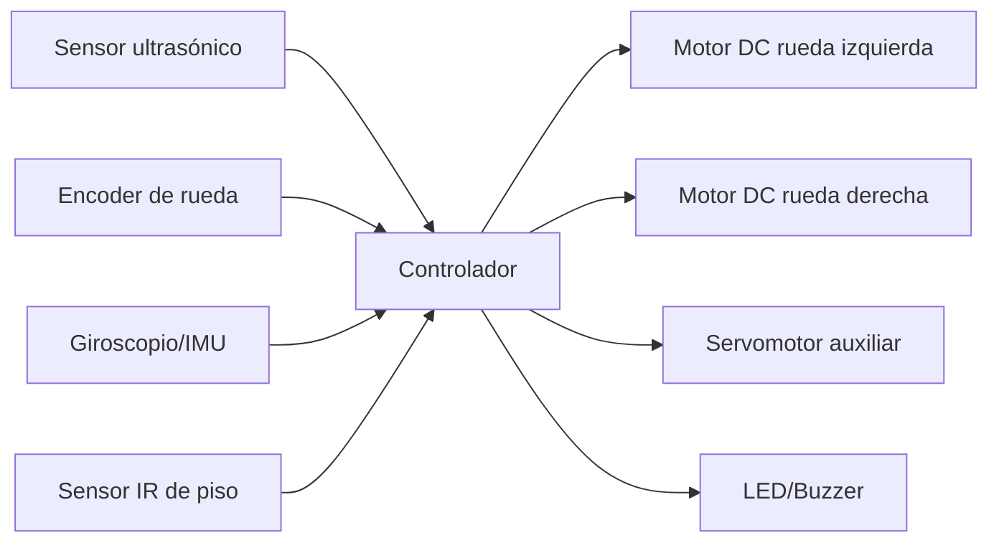

# Sensores y Actuadores en Sistemas Mecatrónicos

**Autor:** Tadeo Alvarez Nájera  
**Matrícula:** 2630002  
**Fecha:** Octubre 2026

---

## 1. Conceptos básicos

### ¿Qué es un sensor?

Un sensor es un dispositivo que detecta o mide una magnitud física del entorno (como temperatura, luz, presión o posición) y la convierte en una señal eléctrica que puede ser interpretada por un sistema de control. Piensa en él como el "órgano de los sentidos" de una máquina: así como nosotros sentimos el calor con la piel o vemos con los ojos, un sistema mecatrónico utiliza sensores para percibir lo que ocurre a su alrededor.

### ¿Qué es un actuador?

Un actuador es un dispositivo que recibe una señal de control (generalmente eléctrica) y la convierte en una acción física: movimiento, fuerza, desplazamiento o cambio de estado. Es el "músculo" del sistema: mientras el sensor informa qué está pasando, el actuador ejecuta la respuesta. Puede generar movimiento rotatorio (como un motor), lineal (como un cilindro) o simplemente abrir/cerrar un contacto (como un solenoide).

### Diferencia entre sensor y actuador

La diferencia fundamental está en la dirección del flujo de información y energía:

|          Aspecto         |                    Sensor                    |                    Actuador                   |
|--------------------------|----------------------------------------------|-----------------------------------------------|
| **Función**              | Mide o detecta una variable física           | Ejecuta una acción física                     |
| **Flujo de información** | Entrada → Sistema de control                 | Sistema de control → Salida                   |
| **Tipo de señal**        | Convierte magnitud física en señal eléctrica | Convierte señal eléctrica en energía mecánica |
| **Analogía**             | Los sentidos                                 | Los músculos                                  |
| **Ejemplo**              | Termopar que mide temperatura                | Motor que mueve una rueda                     |

### Función dentro de un sistema mecatrónico

En un sistema mecatrónico, sensores y actuadores trabajan en conjunto dentro de un lazo de control:

1. **Los sensores** capturan información del entorno y del propio sistema (retroalimentación).
2. **El controlador** (microcontrolador, PLC o computadora) procesa esa información y toma decisiones.
3. **Los actuadores** ejecutan las acciones necesarias para alcanzar el objetivo del sistema.

Sin sensores, el sistema estaría "ciego" y no podría adaptarse a cambios. Sin actuadores, no podría intervenir en el mundo físico.

### Ejemplo: Puerta automática

En una puerta automática de un centro comercial:

- **Sensor de proximidad (infrarrojo o ultrasonido):** detecta cuando una persona se acerca al área de detección.
- **Controlador:** recibe la señal del sensor y decide abrir la puerta.
- **Actuador (motor DC o servomotor):** acciona el mecanismo de apertura de las hojas de la puerta.
- **Sensor de seguridad (barrera infrarroja):** verifica que no haya obstáculos antes de cerrar.
- **Actuador (solenoide o motor):** cierra la puerta cuando el área está despejada.

**Lo que detecta el sensor:** presencia y proximidad de personas (y obstáculos durante el cierre).  
**Lo que hace el actuador:** abre y cierra las hojas de la puerta mediante un mecanismo motorizado.

---

## 2. Investigación de sensores

| Tipo de sensor | Variable que mide | Principio de funcionamiento | Ejemplo comercial | Aplicación |
|---|---|---|---|---|
| **Temperatura** | Temperatura (°C, K, °F) | Cambio de resistencia (RTD, termistor), generación de voltaje por efecto Seebeck (termopar), o voltaje proporcional a temperatura (CI). | LM35 (Texas Instruments) | Monitoreo de temperatura ambiental en invernaderos |
| **Luz** | Intensidad luminosa (lux) | Fotoconductividad: la resistencia del material semiconductor disminuye al recibir luz. | LDR (fotorresistencia) GL5528 | Encendido automático de alumbrado público al anochecer |
| **Proximidad** | Presencia o cercanía de un objeto | Inductivo: campo electromagnético alterado por metales. Capacitivo: cambio de capacitancia por proximidad de materiales conductores o no conductores. | Sensor inductivo Omron E2E | Detección de piezas metálicas en línea de ensamblaje |
| **Distancia** | Distancia a un objeto (cm, m) | Ultrasonido: mide el tiempo de vuelo del eco. Infrarrojo: triangulación por reflexión de luz IR. | HC-SR04 (ultrasonido) | Medición de distancia en robots móviles para evitar colisiones |
| **Presión** | Presión (Pa, bar, psi) | Piezorresistivo: la deformación de un diafragma cambia la resistencia de elementos piezorresistivos en puente de Wheatstone. | Honeywell 26PC Series | Monitoreo de presión en sistemas hidráulicos |
| **Humedad** | Humedad relativa (%) | Capacitivo: cambio de constante dieléctrica del material sensible al absorber vapor de agua. Resistivo: cambio de resistividad al absorber humedad. | Sensor capacitivo DHT22 | Control de humedad en sistemas de riego inteligente |
| **Posición** | Posición angular o lineal | Potenciómetro: resistencia variable según posición del eje. Encoder: disco con ranuras que genera pulsos al girar. | Encoder óptico incremental | Control de posición en brazos robóticos |
| **Velocidad/movimiento** | Velocidad angular (RPM) o lineal | Tacómetro: generación de pulsos proporcionales a la velocidad de rotación. Encoder: cuenta pulsos por vuelta. | Tacómetro magnético | Control de velocidad en motores de cintas transportadoras |
| **Fuerza/peso** | Fuerza (N) o peso (kg) | Galga extensométrica: la deformación de un cuerpo elástico cambia la resistencia de las galgas adheridas, medida en puente de Wheatstone. | Celda de carga LAUMAS | Básculas industriales y control de tensión en bandas |

---

## 3. Clasificación de sensores

### Sensores analógicos y digitales

- **Analógicos:** generan una señal de salida continua que varía proporcionalmente con la magnitud medida. Por ejemplo, un LM35 entrega 10 mV por cada grado centígrado, de forma continua. La característica que los define es que su salida puede tomar cualquier valor dentro de un rango.
- **Digitales:** producen una salida discreta, generalmente en forma de pulsos, niveles lógicos (0/1) o datos codificados. Por ejemplo, un sensor DS18B20 comunica la temperatura mediante un protocolo digital. La característica que los coloca en esta categoría es que su salida solo puede tomar valores finitos y discretos.

### Sensores de contacto y sin contacto

- **De contacto:** requieren que el elemento sensor toque físicamente el objeto o medio a medir. Por ejemplo, un termopar de contacto directo o un potenciómetro de contacto deslizante. La característica es la interacción física directa.
- **Sin contacto:** detectan la variable sin necesidad de tocar el objeto. Por ejemplo, un sensor inductivo de proximidad o un pirómetro infrarrojo. La característica es que la detección se realiza a distancia mediante campos electromagnéticos, ondas o radiación.

### Sensores activos y pasivos

- **Activos:** requieren una fuente de energía externa para funcionar y modulan esa energía en función de la variable medida. Por ejemplo, un sensor capacitivo o un encoder óptico necesitan alimentación eléctrica. La característica es que dependen de una excitación externa.
- **Pasivos:** generan directamente una señal eléctrica en respuesta a la variable medida, sin necesidad de alimentación externa. Por ejemplo, un termopar genera voltaje por sí mismo, o un piezoelectrico genera carga al deformarse. La característica es que son autogeneradores.

---

## 4. Investigación de actuadores

| Actuador | Energía utilizada | Movimiento | Ventaja | Limitación | Aplicación |
|---|---|---|---|---|---|
| **Motor DC** | Eléctrica | Rotatorio continuo | Alta relación par-velocidad, control sencillo de velocidad | Desgaste de escobillas, generación de ruido eléctrico | Ventanas eléctricas de automóviles |
| **Servomotor** | Eléctrica | Rotatorio controlado en posición | Alta precisión por retroalimentación, control de posición y velocidad | Costo elevado, requiere controlador dedicado | Articulaciones de brazos robóticos |
| **Motor paso a paso** | Eléctrica | Rotatorio discreto (pasos) | Control de posición sin sensor externo (lazo abierto), avances pequeños | Puede perder pasos bajo carga, vibración a bajas velocidades | Impresoras 3D, escáneres |
| **Solenoide** | Eléctrica | Lineal de corto recorrido | Respuesta rápida, construcción simple | Recorrido limitado, fuerza decreciente con la distancia | Cerraduras eléctricas, válvulas de riego |
| **Cilindro neumático** | Neumática (aire comprimido) | Lineal de avance y retroceso | Rápida respuesta, bajo mantenimiento, limpio | Fuerza limitada por presión de aire, difícil control de posición intermedia | Empuje de piezas en líneas de producción |
| **Cilindro hidráulico** | Hidráulica (aceite a presión) | Lineal de alta fuerza | Fuerza muy elevada, movimiento suave y preciso | Requiere sistema de bombeo, riesgo de fugas, mantenimiento complejo | Maquinaria pesada, excavadoras, prensas |

---

## 5. Comparación de actuadores

### Motor DC vs. Servomotor

Un motor DC gira de forma continua cuando se le aplica voltaje; su velocidad depende de la tensión y no tiene retroalimentación de posición. Un servomotor es esencialmente un motor DC con un sistema de control en lazo cerrado que incluye un sensor de posición (encoder o potenciómetro) y un controlador.

**Elección:** si necesito mover una rueda de robot a velocidad variable sin importar la posición exacta, usaría un **motor DC**. Si necesito posicionar una articulación en un ángulo específico y mantenerlo, usaría un **servomotor** porque su retroalimentación garantiza precisión.

### Servomotor vs. Motor paso a paso

El servomotor utiliza lazo cerrado y puede corregir errores de posición en tiempo real. El motor paso a paso funciona típicamente en lazo abierto: se le envían pulsos y se asume que el rotor avanza un paso por cada pulso, sin verificar si realmente lo hizo.

**Elección:** para una impresora 3D donde el cabezal debe avanzar distancias pequeñas y repetibles con control sencillo, elegiría un **motor paso a paso**. Para un brazo robótico que debe sostener una carga y corregir su posición ante perturbaciones, elegiría un **servomotor**.

### Actuador neumático vs. hidráulico

Los actuadores neumáticos usan aire comprimido, son más limpios y rápidos, pero generan menos fuerza. Los hidráulicos usan aceite a presión, generan fuerzas muy superiores y movimiento más suave, pero requieren sistemas de bombeo y mantenimiento más complejo.

**Elección:** para empujar una caja ligera en una línea de empaque, usaría un **cilindro neumático** por su rapidez y bajo costo. Para levantar el brazo de una excavadora que debe vencer fuerzas enormes, usaría un **cilindro hidráulico**.

---

## 6. Sensores y actuadores en un sistema real: Robot móvil

Un robot móvil autónomo es un sistema mecatrónico ideal para ilustrar la integración de sensores y actuadores.

### Elementos identificados

| Elemento | Tipo | Función |
|---------------------------|------------------------------|-----------------------------------------------------------------------------|
| Sensor ultrasónico        | Sensor de distancia          | Mide la distancia a obstáculos frontales y laterales para evitar colisiones |
| Encoder de rueda          | Sensor de velocidad/posición | Mide el giro de cada rueda para calcular odometría y velocidad              |
| Giroscopio/IMU            | Sensor de orientación        | Detecta la orientación y los cambios de dirección del robot                 |
| Sensor infrarrojo de piso | Sensor de proximidad         | Detecta bordes o líneas en el suelo para no caer                            |
| Motor DC con reductora    | Actuador                     | Acciona cada rueda para desplazar el robot                                  |
| Servomotor                | Actuador                     | Mueve un sensor o mecanismo auxiliar (por ejemplo, un brazo de recogida)    |
| Buzzer/LED                | Actuador de señalización     | Emite alertas sonoras o visuales según el estado del robot                  |

### Diagrama de relación

**Explicación del diagrama:** Los sensores envían información al controlador (microcontrolador o computadora a bordo). El controlador procesa esos datos y genera señales de control para los actuadores, que ejecutan el movimiento y las alertas. Este es el ciclo fundamental de percepción → decisión → acción que define a un sistema mecatrónico.

---

## 7. Selección de componentes

| Situación | Componente seleccionado | Tipo | Razón de la elección |
|---|---|---|---|
| Detectar si una persona se encuentra frente a una puerta automática | Sensor de proximidad infrarrojo o ultrasónico | Sensor | Detecta presencia sin contacto, respuesta rápida, adecuado para detección de personas en movimiento |
| Medir la temperatura dentro de un salón | LM35 | Sensor | Salida analógica lineal (10 mV/°C), precisión adecuada, bajo costo y fácil interfaz con microcontroladores |
| Detectar el nivel de agua de un depósito | Sensor ultrasónico de nivel | Sensor | Mide distancia a la superficie del agua sin contacto, precisa y adecuada para líquidos |
| Mover una rueda de un robot móvil | Motor DC con reductora | Actuador | Proporciona movimiento rotatorio continuo, par suficiente, control de velocidad sencillo mediante PWM |
| Controlar con precisión el ángulo de una pequeña articulación robótica | Servomotor | Actuador | Retroalimentación de posición integrada, permite fijar ángulos específicos con alta precisión |
| Empujar una pieza en una línea de producción | Cilindro neumático de doble efecto | Actuador | Movimiento lineal rápido, bajo mantenimiento, ideal para empujes repetitivos en automatización industrial |
| Medir la distancia entre un robot y una pared | Sensor ultrasónico | Sensor | Mide distancia por tiempo de vuelo, funciona en interiores, sin necesidad de contacto |
| Detectar si una habitación está iluminada | LDR (fotorresistencia) | Sensor | Cambia su resistencia según la intensidad luminosa, simple y económico para detectar presencia/ausencia de luz |

---

## 8. Reflexión final

### ¿Qué diferencia encuentras entre medir una variable y realizar una acción física?

Medir una variable implica obtener información del entorno sin modificarlo: es un proceso de percepción. Realizar una acción física implica intervenir en el mundo, consumir energía y producir un cambio tangible. Un sensor puede medir la temperatura de una habitación sin alterarla; un actuador que enciende un calentador modifica el estado del sistema. La medición es pasiva (o requiere poca energía para excitar), mientras que la acción es activa y demanda potencia.

### ¿Por qué un sistema mecatrónico normalmente necesita sensores y actuadores?

Porque un sistema mecatrónico debe interactuar con el mundo real de forma inteligente. Los sensores le permiten conocer el estado del entorno y de sí mismo (retroalimentación), y los actuadores le permiten actuar sobre ese entorno para cumplir su objetivo. Sin sensores, el sistema sería ciego y no podría adaptarse; sin actuadores, sería un observador pasivo incapaz de influir. La combinación de ambos es lo que permite el control automático y la autonomía.

### ¿Qué sensor o actuador de los investigados te pareció más interesante y por qué?

El **servomotor** me resultó especialmente interesante porque combina en un solo dispositivo un motor, un sistema de reducción, un sensor de posición y un controlador. Es un ejemplo perfecto de integración mecatrónica: la retroalimentación le permite corregir errores en tiempo real, algo que un motor DC simple no puede hacer. Además, su aplicación en robótica, prótesis y sistemas de posicionamiento preciso lo convierte en una pieza clave de la automatización moderna.

---

## 9. Referencias

1. Texas Instruments. (2017). *LM35 Precision Centigrade Temperature Sensors* (Rev. H). https://www.ti.com/product/LM35
2. WIKA. *Transductores de fuerza de compresión*. https://www.wika.com/es-ar/transductores_de_fuerza_de_compresion.WIKA
3. Honeywell. *26PC Series Low Pressure Sensors*. https://automation.honeywell.com/us/en/products/sensing-solutions/sensors/pressure-sensors/26pc-series
4. Omron. *E2E Inductive Proximity Sensor*. https://www.ia.omron.com
5. Bosch Rexroth. *MSK Series AC Servomotors*. https://www.boschrexroth.com
6. SMC Corporation. *Cilindros neumáticos serie CM2*. https://www.smcworld.com
7. Parker Hannifin. *Hydraulic Cylinders Series RDH*. https://www.parker.com
8. National Instruments. *Implementing Closed-Loop Control: Step by Step Procedure*. https://www.ni.com
9. LAUMAS. (2024). *Qué es una célula de carga y cómo funciona*. https://www.laumas.com
10. WIKA. *Transductores de fuerza*. https://www.wika.com
11. Texas Instruments. *DC Motor Overview*. https://www.ti.com
12. IEEE. *Position Sensors*. https://www.ewh.ieee.org
13. EPFL. *Pneumatic Cylinder*. https://graphsearch.epfl.ch
14. ScienceDirect. *Hydraulic Cylinders*. https://www.sciencedirect.com
15. ScienceDirect. *Humidity Sensors*. https://www.sciencedirect.com
16. ScienceDirect. *Proximity Sensor*. https://www.sciencedirect.com
17. ScienceDirect. *Photoresistors*. https://www.sciencedirect.com
18. UC3M. *Sensores de distancia y ultrasonidos*. https://e-archivo.uc3m.es
19. UNAM. *Motores paso a paso*. https://www.ptolomeo.unam.mx
20. CATEDU. *Sensor de temperatura LM35D*. https://libros.catedu.es
21. FAO AGRIS. *Medidor ultrasónico de nivel de agua*. https://agris.fao.org
22. Zenodo. (2021). *Design and Construction of an Automatic Temperature Control System*. https://zenodo.org
23. DirectIndustry. *Sensor de seguridad para puertas automáticas OAM-DUAL II*. https://www.directindustry.es
24. Educa2 Madrid. *Prácticas de electrónica con LDR*. https://www.educa2.madrid.org
25. RIUNET UPV. *Sensores: clasificación y principios*. https://riunet.upv.es